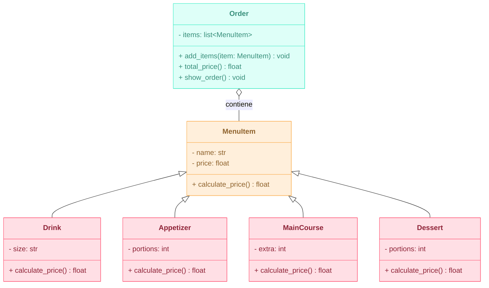
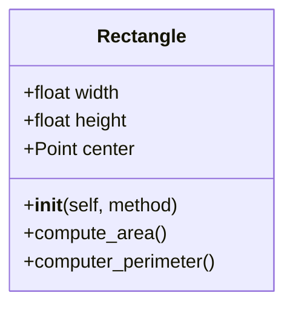
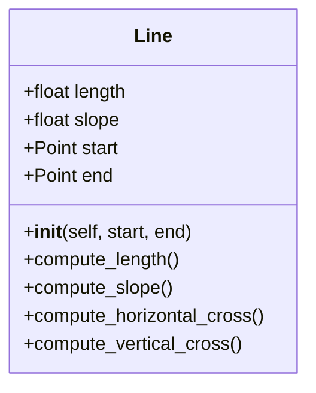

# Reto-03---POO
Desarrollo del ejercicio del reto 03:

**Escenario de restaurante:** desea diseñar un programa para calcular la factura del pedido de un cliente en un restaurante.\
-Definir una clase base MenuItem : Esta clase debe tener atributos como nombre, precio y un método para calcular el precio total.\
-Cree subclases para diferentes tipos de elementos de menú: herede de MenuItem y defina propiedades específicas para cada tipo (por ejemplo, Bebida, Aperitivo, Plato principal).\
-Definir una clase Order: Esta clase debe tener una lista de objetos MenuItem y métodos para agregar artículos, calcular el monto total de la factura y potencialmente aplicar descuentos específicos según la composición del pedido.\
Cree un diagrama de clases con todas las clases y sus relaciones. El menú debe tener al menos 10 elementos. El código debe seguir las reglas PEP8.

**Diagrama de Clases:**


**Código Python:**
Para dar solución a este reto primero se genero la clase base de *MenuItem* con sus atributos correspondientes y único método para calcular el precio. Luego se crearon las 4 siguientes clases que heredan los atributos y el método mencionado de *MenuItem*, pero con este último modificado según las condiciones de cada plato. Así mismo, se genero la clase de *Order* que permite generar el pedido deseado y dentro de esta sus múltiples métodos. Al final se estableció un menú de 12 items y se crea un *Pedido* agregando lo que se desea del menú.

```python
class MenuItem:
    def __init__(self, name: str, price: float):
        self.name = name
        self.price = price
    
    def calculate_price(self) -> float:
        return self.price


class Drink(MenuItem):
    def __init__(self, name, price, size: str):
        super().__init__(name, price)
        self.size = size
    
    def calculate_price(self) -> float:
        if self.size == "Pequeña":
            return self.price
        elif self.size == "Mediana":
            return self.price + 5.0
        elif self.size == "Grande":
            return self.price + 10.0
        else:
            raise ValueError("Tamaño inválido")


class Appetizer(MenuItem):
    def __init__(self, name, price, portions: int):
        super().__init__(name, price)
        self.portions = portions
    
    def calculate_price(self) -> float:
        return self.price * self.portions
        

class MainCourse(MenuItem):
    def __init__(self, name, price, extra: int):
        super().__init__(name, price)
        self.extra = extra
    
    def calculate_price(self) -> float:
        if self.extra == 0:
            return self.price
        else:
            return self.price + (8.0 * self.extra)


class Dessert(MenuItem):
    def __init__(self, name, price, portions: int):
        super().__init__(name, price)
        self.portions = portions
    
    def calculate_price(self) -> float:
        return self.price * self.portions


class Order:
    def __init__(self):
        self.items = []
    
    def add_items(self, item: MenuItem):
        self.items.append(item)
    
    def total_price(self) -> float:
        return sum(item.calculate_price() for item in self.items)

    def show_order(self):
        print("---- FACTURA ----")
        for item in self.items:
            print(f"{item.name}: $ {item.calculate_price():.2f}")
        print("-----------------")
        print(f"Total: $ {self.total_price():.2f}")
        print("-----------------")


# Menú con 12 ítems
menu = [
    Drink("Coca-Cola", 5.0, "Grande"),
    Drink("Agua", 3.0, "Pequeña"),
    Drink("Jugo", 4.0, "Mediana"),
    Appetizer("Papas fritas", 8.0, 2),
    Appetizer("Aros de Cebolla", 10.0, 1),
    Appetizer("Alitas BBQ", 12.0, 2),
    MainCourse("Hamburguesa", 15.0, 1),
    MainCourse("Pasta Pesto", 12.0, 0),
    MainCourse("Pizza", 20.0, 2),
    Dessert("Helado", 6.0, 2),
    Dessert("Brownie", 7.0, 1),
    Dessert("Pudín", 5.0, 1)
]

# Pedido de ejemplo
pedido = Order()
pedido.add_items(menu[0])
pedido.add_items(menu[3])
pedido.add_items(menu[5])
pedido.add_items(menu[3])

pedido.show_order()

```

# Ejercicios Adicionales:

1. Cree la clase Rectangle.

 - El rectángulo debe inicializarse utilizando cualquiera de estos 3 métodos:
    + Método 1: Esquina inferior izquierda (Punto) + ancho y alto
    + Método 2: Centro(Punto) + ancho y alto
    + Método 3: Dos esquinas opuestas (puntos), por ejemplo, inferior izquierda y superior derecha

 - ancho , alto , centro: atributos de instancia
 - compute_area(): debe devolver el área del rectángulo
 - compute_perimeter(): debe devolver el perímetro del rectángulo
2. Cree una clase Square() que herede los atributos y métodos necesarios de Rectangle.
3. Cree un método llamado compute_interference_point(Point) que devuelva si un punto está dentro de un rectángulo.
4. **Opcional:** Defina un método llamado compute_interference_line() que devuelva si una línea o parte de ella está dentro de un rectángulo.

```python
class Point:
    def __init__(self, x: float, y: float):
        self.x = x
        self.y = y


class Rectangle:
    def __init__(self, corner: Point = None, center: Point = None,
                 p1: Point = None, p2: Point = None,
                 width: float = 0.0, height: float = 0.0):

        # Caso 1: esquina + ancho + alto
        if corner and width and height:
            self.bottom_left = corner
            self.width = width
            self.height = height
            self.top_right = Point(corner.x + width, corner.y + height)
            self.center = Point(corner.x + width / 2, corner.y + height / 2)

        # Caso 2: centro + ancho + alto
        elif center and width and height:
            self.center = center
            self.width = width
            self.height = height
            self.bottom_left = Point(center.x - width / 2, center.y - height / 2)
            self.top_right = Point(center.x + width / 2, center.y + height / 2)

        # Caso 3: dos puntos opuestos
        elif p1 and p2:
            self.bottom_left = Point(min(p1.x, p2.x), min(p1.y, p2.y))
            self.top_right = Point(max(p1.x, p2.x), max(p1.y, p2.y))
            self.width = self.top_right.x - self.bottom_left.x
            self.height = self.top_right.y - self.bottom_left.y
            self.center = Point(self.bottom_left.x + self.width / 2,
                                self.bottom_left.y + self.height / 2)
        else:
            raise ValueError("No se ingresaron parámetros válidos.")

    def compute_area(self) -> float:
        return self.width * self.height

    def compute_perimeter(self) -> float:
        return 2 * (self.width + self.height)

    def compute_interference_point(self, point: Point) -> bool:
        if (self.bottom_left.x <= point.x <= self.top_right.x and
                self.bottom_left.y <= point.y <= self.top_right.y):
            return True
        return False


class Square(Rectangle):
    def __init__(self, corner: Point = None, center: Point = None,
                 p1: Point = None, p2: Point = None, side: float = 0.0):
        if side:
            if corner:
                super().__init__(corner=corner, width=side, height=side)
            elif center:
                super().__init__(center=center, width=side, height=side)
            else:
                raise ValueError("Se requiere corner o center con side.")
            self.side = side
        elif p1 and p2:
            dx = abs(p1.x - p2.x)
            dy = abs(p1.y - p2.y)
            if dx != dy:
                raise ValueError("Los puntos no forman un cuadrado.")
            super().__init__(p1=p1, p2=p2)
            self.side = dx
        else:
            raise ValueError("No se ingresaron parámetros válidos.")


#Ejemplo:
r1 = Rectangle(corner=Point(0, 0), width=4.0, height=6.0)
print("Área r1:", r1.compute_area())

s1 = Square(center=Point(0, 0), side=4.0)
print("Perímetro s1:", s1.compute_perimeter())
```

1. Cree clase Line.

 - *longitud* , *pendiente* , inicio, fin: atributos de instancia, dos de ellos son puntos (por lo que una línea se compone al menos de dos puntos).
 - ompute_length(): debe devolver la longitud de la línea
 - compute_slope(): debe devolver la pendiente de la línea desde la horizontal en grados.
 - compute_horizontal_cross(): debe devolver si existe la intersección con el eje x
 - compute_vertical_cross(): debe devolver si existe la intersección con el eje y

2. Redefinir la clase Rectángulo, agregando un nuevo método de inicialización utilizando 4 Líneas (la composición en su mejor expresión, un rectángulo se compone de 4 líneas).

3. **Opcional:** Defina un método llamado discretize_line() que crea una matriz en n puntos igualmente espaciados en la línea y se asigna como un atributo de instancia.

```python
import math

class Point:
    def __init__(self, x: float, y: float):
        self.x: float = x
        self.y: float = y


class Line:
    def __init__(self, start: Point, end: Point):
        self.start: Point = start
        self.end: Point = end
        self.length: float = self.compute_length()
        self.slope: float = self.compute_slope()

    def compute_length(self) -> float:
        return math.sqrt((self.end.x - self.start.x) ** 2 +
                         (self.end.y - self.start.y) ** 2)

    def compute_slope(self) -> float:
        dx = self.end.x - self.start.x
        dy = self.end.y - self.start.y
        if dx == 0:  # línea vertical → pendiente infinita
            return float("inf")
        return math.degrees(math.atan2(dy, dx))

    def compute_horizontal_cross(self) -> bool:
        return (self.start.y == 0 or self.end.y == 0 or
                (self.start.y > 0 > self.end.y) or (self.start.y < 0 < self.end.y))

    def compute_vertical_cross(self) -> bool:
        return (self.start.x == 0 or self.end.x == 0 or
                (self.start.x > 0 > self.end.x) or (self.start.x < 0 < self.end.x))

    def discretize_line(self, n: int) -> list[Point]:
        points: list[Point] = []
        for i in range(n):
            x = self.start.x + i * (self.end.x - self.start.x) / (n - 1)
            y = self.start.y + i * (self.end.y - self.start.y) / (n - 1)
            points.append(Point(x, y))
        return points


class Rectangle:
    def __init__(self,
                 corner: Point = None,
                 width: float = 0.0,
                 height: float = 0.0,
                 center: Point = None,
                 opposite_corner: Point = None,
                 lines: list[Line] = None):

        if lines is not None:
            #Rectángulo definido por 4 líneas
            self.sides: list[Line] = lines
            xs = [line.start.x for line in lines] + [line.end.x for line in lines]
            ys = [line.start.y for line in lines] + [line.end.y for line in lines]
            self.width: float = max(xs) - min(xs)
            self.height: float = max(ys) - min(ys)
            self.center: Point = Point((max(xs) + min(xs)) / 2, (max(ys) + min(ys)) / 2)

        elif corner is not None:
            #Método 1: Esquina inferior izquierda
            self.width: float = width
            self.height: float = height
            self.center: Point = Point(corner.x + width / 2, corner.y + height / 2)
            p1 = corner
            p2 = Point(corner.x + width, corner.y)
            p3 = Point(corner.x + width, corner.y + height)
            p4 = Point(corner.x, corner.y + height)
            self.sides: list[Line] = [Line(p1, p2), Line(p2, p3), Line(p3, p4), Line(p4, p1)]

        elif center is not None:
            #Método 2: Centro
            self.width: float = width
            self.height: float = height
            self.center: Point = center
            p1 = Point(center.x - width / 2, center.y - height / 2)
            p2 = Point(center.x + width / 2, center.y - height / 2)
            p3 = Point(center.x + width / 2, center.y + height / 2)
            p4 = Point(center.x - width / 2, center.y + height / 2)
            self.sides: list[Line] = [Line(p1, p2), Line(p2, p3), Line(p3, p4), Line(p4, p1)]

        elif opposite_corner is not None:
            #Método 3: Esquinas opuestas
            x_min = min(corner.x, opposite_corner.x)
            x_max = max(corner.x, opposite_corner.x)
            y_min = min(corner.y, opposite_corner.y)
            y_max = max(corner.y, opposite_corner.y)
            self.width: float = x_max - x_min
            self.height: float = y_max - y_min
            self.center: Point = Point((x_min + x_max) / 2, (y_min + y_max) / 2)
            p1 = Point(x_min, y_min)
            p2 = Point(x_max, y_min)
            p3 = Point(x_max, y_max)
            p4 = Point(x_min, y_max)
            self.sides: list[Line] = [Line(p1, p2), Line(p2, p3), Line(p3, p4), Line(p4, p1)]

    def compute_area(self) -> float:
        return self.width * self.height

    def compute_perimeter(self) -> float:
        return 2 * (self.width + self.height)

    def compute_interference_point(self, point: Point) -> bool:
        x_min = min(side.start.x for side in self.sides)
        x_max = max(side.start.x for side in self.sides)
        y_min = min(side.start.y for side in self.sides)
        y_max = max(side.start.y for side in self.sides)
        return x_min <= point.x <= x_max and y_min <= point.y <= y_max

    def compute_interference_line(self, line: Line) -> bool:
        # 1) Si alguno de los extremos está dentro
        if self.compute_interference_point(line.start) or self.compute_interference_point(line.end):
            return True

        #Verificar si cruza con alguno de los lados del rectángulo
        for side in self.sides:
            if self._lines_intersect(line, side):
                return True
        return False

    def _lines_intersect(self, l1: Line, l2: Line) -> bool:
        """Algoritmo para saber si dos segmentos de recta se cruzan"""

        def ccw(A: Point, B: Point, C: Point) -> bool:
            return (C.y - A.y) * (B.x - A.x) > (B.y - A.y) * (C.x - A.x)

        A, B = l1.start, l1.end
        C, D = l2.start, l2.end
        return (ccw(A, C, D) != ccw(B, C, D)) and (ccw(A, B, C) != ccw(A, B, D))


#Ejemplos:

# Definimos un rectángulo con esquina inferior izquierda (0,0), ancho=10, alto=5
rect = Rectangle(corner=Point(0, 0), width=10.0, height=5.0)

print("Área rectángulo:", rect.compute_area())       # 50
print("Perímetro rectángulo:", rect.compute_perimeter())  # 30

p1 = Point(3, 2)
print("¿Punto (3,2) dentro del rectángulo?:", rect.compute_interference_point(p1))

p2 = Point(11, 4)
print("¿Punto (11,4) dentro del rectángulo?:", rect.compute_interference_point(p2))

line1 = Line(Point(2, 2), Point(8, 3))
print("¿Línea dentro del rectángulo?:", rect.compute_interference_line(line1))

line2 = Line(Point(-2, 2), Point(12, 2))
print("¿Línea cruza el rectángulo?:", rect.compute_interference_line(line2))

line3 = Line(Point(20, 20), Point(25, 25))
print("¿Línea fuera del rectángulo?:", rect.compute_interference_line(line3))


```


