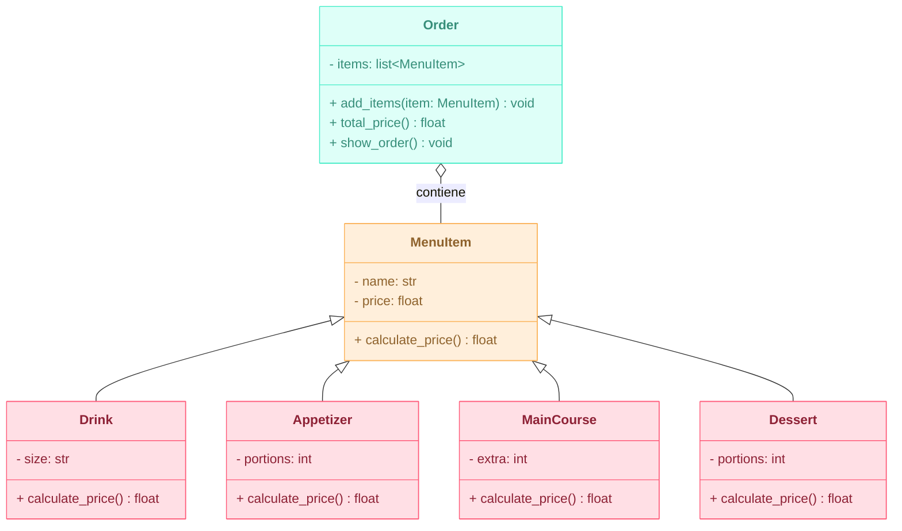

# Reto-03---POO
Desarrollo del ejercicio del reto 03:

**Escenario de restaurante:** desea diseñar un programa para calcular la factura del pedido de un cliente en un restaurante.
-Definir una clase base MenuItem : Esta clase debe tener atributos como nombre, precio y un método para calcular el precio total.
-Cree subclases para diferentes tipos de elementos de menú: herede de MenuItem y defina propiedades específicas para cada tipo (por ejemplo, Bebida, Aperitivo, Plato principal).
-Definir una clase Order: Esta clase debe tener una lista de objetos MenuItem y métodos para agregar artículos, calcular el monto total de la factura y potencialmente aplicar descuentos específicos según la composición del pedido.
Cree un diagrama de clases con todas las clases y sus relaciones. El menú debe tener al menos 10 elementos. El código debe seguir las reglas PEP8.

**Diagrama de Clases:**


**Código Python:**
Para dar solución a este reto primero se genero la clase base de *MenuItem* con sus atributos correspondientes y único método para calcular el precio. Luego se crearon las 4 siguientes clases que heredan los atributos y el método mencionado de *MenuItem*, pero con este último modificado según las condiciones de cada plato. Así mismo, se genero la clase de *Order* que permite generar el pedido deseado y dentro de esta sus múltiples métodos. Al final se estableció un menú de 12 items y se crea un *Pedido* agregando lo que se desea del menú.

```python
class MenuItem:
    def __init__(self, name: str, price: float):
        self.name = name
        self.price = price
    
    def calculate_price(self) -> float:
        return self.price


class Drink(MenuItem):
    def __init__(self, name, price, size: str):
        super().__init__(name, price)
        self.size = size
    
    def calculate_price(self) -> float:
        if self.size == "Pequeña":
            return self.price
        elif self.size == "Mediana":
            return self.price + 5.0
        elif self.size == "Grande":
            return self.price + 10.0
        else:
            raise ValueError("Tamaño inválido")


class Appetizer(MenuItem):
    def __init__(self, name, price, portions: int):
        super().__init__(name, price)
        self.portions = portions
    
    def calculate_price(self) -> float:
        return self.price * self.portions
        

class MainCourse(MenuItem):
    def __init__(self, name, price, extra: int):
        super().__init__(name, price)
        self.extra = extra
    
    def calculate_price(self) -> float:
        if self.extra == 0:
            return self.price
        else:
            return self.price + (8.0 * self.extra)


class Dessert(MenuItem):
    def __init__(self, name, price, portions: int):
        super().__init__(name, price)
        self.portions = portions
    
    def calculate_price(self) -> float:
        return self.price * self.portions


class Order:
    def __init__(self):
        self.items = []
    
    def add_items(self, item: MenuItem):
        self.items.append(item)
    
    def total_price(self) -> float:
        return sum(item.calculate_price() for item in self.items)

    def show_order(self):
        print("---- FACTURA ----")
        for item in self.items:
            print(f"{item.name}: $ {item.calculate_price():.2f}")
        print("-----------------")
        print(f"Total: $ {self.total_price():.2f}")
        print("-----------------")


# Menú con 12 ítems
menu = [
    Drink("Coca-Cola", 5.0, "Grande"),
    Drink("Agua", 3.0, "Pequeña"),
    Drink("Jugo", 4.0, "Mediana"),
    Appetizer("Papas fritas", 8.0, 2),
    Appetizer("Aros de Cebolla", 10.0, 1),
    Appetizer("Alitas BBQ", 12.0, 2),
    MainCourse("Hamburguesa", 15.0, 1),
    MainCourse("Pasta Pesto", 12.0, 0),
    MainCourse("Pizza", 20.0, 2),
    Dessert("Helado", 6.0, 2),
    Dessert("Brownie", 7.0, 1),
    Dessert("Pudín", 5.0, 1)
]

# Pedido de ejemplo
pedido = Order()
pedido.add_items(menu[0])
pedido.add_items(menu[3])
pedido.add_items(menu[5])
pedido.add_items(menu[3])

pedido.show_order()

```
